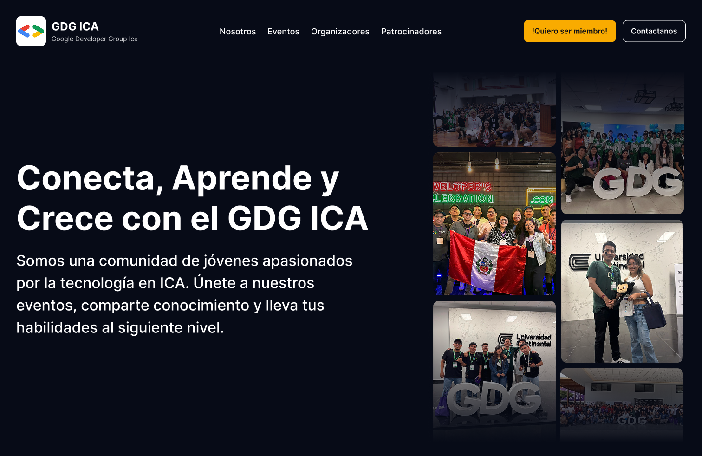

# Google Developer Group (GDG) ICA - Sitio Web Oficial



[🌐 gdgica.com](https://gdgica.com) · [🖼️ Diseño en Figma](https://www.figma.com/design/OsE9m2hnvt7DjuI7e7Ocx3/GDG-ICA?node-id=0-1&t=XAHKhrJY81pkcRk6-1)

## Sobre el Proyecto

Sitio web oficial del Google Developer Group (GDG) ICA, construido con Astro 5 como sitio estático. Todo el contenido (eventos, speakers, equipo, sponsors) se gestiona desde el repositorio externo [gdg-ica-data](https://github.com/GDGXICA/gdg-ica-data) y se consume en build time mediante custom loaders.

### Tecnologías

- [Astro 5](https://astro.build) — Framework web estático
- [TailwindCSS 4](https://tailwindcss.com) — Estilos utilitarios
- [React 19](https://react.dev) — Islas interactivas (solo donde se necesita JS en el cliente)
- [Firebase Hosting](https://firebase.google.com/docs/hosting) — Despliegue y CDN

### Páginas

| Ruta              | Descripción                                                    |
| ----------------- | -------------------------------------------------------------- |
| `/`               | Homepage                                                       |
| `/eventos`        | Listado de eventos                                             |
| `/eventos/[slug]` | Detalle de evento (agenda, speakers, sponsors, QR de WhatsApp) |
| `/equipo`         | Equipo organizador y miembros                                  |
| `/nosotros`       | Acerca de GDG ICA                                              |
| `/patrocinadores` | Sponsors                                                       |
| `/voluntarios`    | Voluntarios                                                    |
| `/gallery`        | Galería de fotos                                               |

### Datos

Todo el contenido proviene de [`GDGXICA/gdg-ica-data`](https://github.com/GDGXICA/gdg-ica-data). Los loaders en `src/loaders/` fetchean los JSON en build time desde ese repositorio. En CI se usa un clone local para evitar staleness del CDN.

## Requerimientos

- Git
- Node 22.15.0
- PNPM 10.11.0

## Instalación

```sh
pnpm install
pnpm dev
```

El servidor de desarrollo corre en `http://localhost:4321`.

## Comandos

| Comando        | Acción                                     |
| -------------- | ------------------------------------------ |
| `pnpm install` | Instalar dependencias                      |
| `pnpm dev`     | Servidor de desarrollo en `localhost:4321` |
| `pnpm build`   | Build de producción en `./dist/`           |
| `pnpm preview` | Preview del build                          |
| `pnpm lint`    | Ejecutar ESLint                            |
| `pnpm format`  | Formatear con Prettier                     |

## Mini-juegos en eventos

Esta sección guía al equipo organizador para correr mini-juegos en vivo durante un evento (encuestas, quiz, nube de palabras, bingo).

### Pre-evento

1. **Plantillas** — desde `/admin/minigame-templates` crea las plantillas que vas a usar (poll, quiz, wordcloud, bingo). Las plantillas son reutilizables entre eventos.
2. **Adjuntar al evento** — desde `/admin/eventos`, haz click en "🎮 Mini-juegos" en la fila del evento para abrir `/admin/eventos/minigames?slug=<id>`. Adjunta cada plantilla que vayas a usar.
3. **Anonymous Authentication** — confirma que está habilitado en Firebase Console (Authentication → Sign-in method → Anonymous). Sin esto los participantes no se pueden unir en producción. El emulador local lo activa solo.
4. **Smoke test** — abre `https://gdgica.com/eventos/<slug>?play=1` en una pestaña incognito antes del evento y verifica que aparezca el modal de unión.

### Durante el evento

1. **Conecta el proyector** — desde el panel admin del evento, click en "📺 Abrir proyector". Se abre `/eventos/<slug>/proyector` en una nueva pestaña; muévela a la pantalla del venue.
2. **Activa los juegos globales** (bingo + wordcloud) al inicio. Están pensados para correr durante todo el evento.
3. **Activa polls / quizzes** en momentos puntuales:
   - Click "▶ Iniciar" en la card del juego cuando quieras lanzarlo.
   - Para quiz, "⏭ Avanzar pregunta" controla el timer y la siguiente pregunta.
   - Click "⏹ Cerrar" cuando termine.
4. **Comparte la URL de unión** — el botón "📋 Copiar URL de unión" copia `https://gdgica.com/eventos/<slug>?play=1` al portapapeles; pégalo en el WhatsApp del evento o cualquier canal.
5. **Modera el wordcloud** — el botón "Ver moderación" en cada card de wordcloud abre un panel donde admin oculta palabras inapropiadas. Los cambios se reflejan en el proyector y en los celulares en <1s.
6. **Quiz en vivo** — la pantalla del proyector muestra timer, opciones, y leaderboard top-10. Los participantes ven lo mismo en sus celulares.

### Post-evento

1. **Cierra los juegos** (state=closed) desde el panel admin para detener escrituras.
2. **Premia a los ganadores** — botón "Ver ganadores" en la card de bingo lista los participantes con `bingoWonAt` ordenados por timestamp.
3. Los datos quedan en Firestore para análisis posterior — no es necesario borrar nada.

### Solución de problemas comunes

- **El modal no aparece para los participantes**: verifica que el juego esté en `live` y que Anonymous Authentication esté habilitado en Firebase Console.
- **El QR del proyector apunta al dominio incorrecto**: el QR se genera al build con `https://gdgica.com`. Re-deployar después de cambios de dominio.
- **"Demasiados intentos"** al unirse: el rate limiter por IP es 10/min. Para eventos grandes en una misma red WiFi, ajusta `joinLimiter` en `functions/src/index.ts`.
- **Borrar una plantilla adjuntada**: solo se puede borrar una instancia en `state=scheduled`. Cierra el juego primero (`live` → `closed`) y luego archívalo visualmente; los datos históricos quedan.

## Estructura del proyecto

```plaintext
/
├── public/              # Assets estáticos (imágenes, fonts)
├── src/
│   ├── components/      # Componentes Astro (.astro)
│   │   └── react/       # Islas React (solo client-side interactivo)
│   ├── layouts/         # Layout principal
│   ├── loaders/         # Custom loaders para gdg-ica-data
│   ├── pages/           # Rutas (file-based routing)
│   ├── styles/          # CSS global y variables
│   └── content.config.ts # Schemas Zod de las colecciones
├── functions/           # Cloud Functions (API backend)
└── .github/workflows/   # CI/CD con GitHub Actions
```

## Despliegue

GitHub Actions (`.github/workflows/deploy.yml`) construye y despliega a Firebase Hosting en cada push a `main`. También se dispara automáticamente cuando el repositorio de datos se actualiza.

## Cómo Contribuir

1. Clona el proyecto
2. Crea una rama (`git checkout -b feature/AmazingFeature`)
3. Haz commit siguiendo Conventional Commits (`git commit -m 'feat: add amazing feature'`)
4. Push a la rama (`git push origin feature/AmazingFeature`)
5. Abre un Pull Request

> Antes de codificar, revisa los issues y PRs existentes para evitar trabajo duplicado.

### Estándares

**Commits** — Conventional Commits obligatorio:

| Prefijo     | Uso                           |
| ----------- | ----------------------------- |
| `feat:`     | Nueva funcionalidad           |
| `fix:`      | Corrección de bug             |
| `docs:`     | Documentación                 |
| `style:`    | Formato, sin cambio de lógica |
| `refactor:` | Refactorización               |
| `test:`     | Tests                         |
| `chore:`    | Mantenimiento, tooling        |

**Código:**

- Variables y funciones en camelCase
- Componentes Astro/React en PascalCase
- Tailwind para estilos, evitar CSS custom
- Sin `!important`, sin `console.log` en producción
- No añadir dependencias sin discutirlo primero

**Pull Requests:**

- Requieren al menos una aprobación
- PR pequeños y enfocados en una sola cosa
- Capturas de pantalla para cambios visuales

## Licencia

MIT — ver [LICENSE.md](LICENSE.md)
